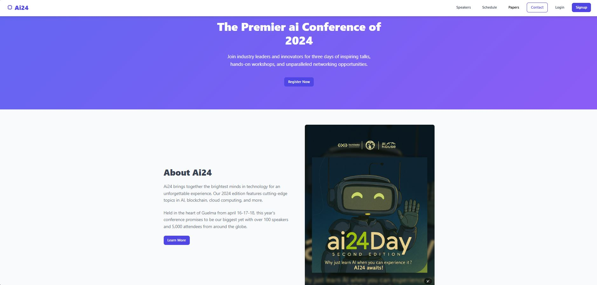
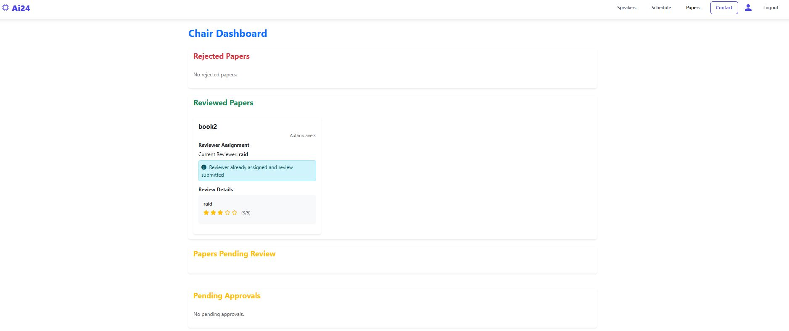

# 📝 Conference Paper Management System


A sophisticated academic conference management platform with multi-role access, paper submission, and peer review capabilities.



## ✨ Features

### 🧑‍💻 Role-Based Access
| Role        | Capabilities                          |
|-------------|---------------------------------------|
| **Authors** | Submit papers, track status           |
| **Reviewers** | Evaluate papers, provide ratings     |
| **Chairs**  | Manage review process, assign papers  |
| **Super Chairs** | Approve users, full oversight      |

### 📄 Paper Management
- Secure file upload (PDF/DOCX)
- Automated file naming
- Status tracking (Submitted → Under Review → Decision)
- Download functionality

### ⭐ Review System
- 5-star rating interface
- Average score calculation
- Visual rating display
```diff
+ Excellent paper! 4/5
- Needs improvement 2/5
```

## 🛠️ Technical Stack

**Backend**  
PHP 8.1+  
Laravel 10  
MySQL Database  
File Storage (Local/Cloud)  

**Frontend**  
Bootstrap 5  
Font Awesome Icons  
Responsive Design  

**Security**  
CSRF Protection  
File Validation  
.env Configuration  
Role Middleware  

## 🚀 Installation

```bash
# Clone repository
git clone https: https://github.com/0ahmed0ghoul/Conference-Paper-Management-System


# Install dependencies
composer install
npm install

# Configure environment
cp .env.example .env
php artisan key:generate

# Set up database
php artisan migrate --seed
```

## 🌈 Interface Preview

**Dashboard**  




**Paper Submission**

```html
<form class="modern-form">
  <input type="text" placeholder="Paper Title">
  <textarea placeholder="Abstract"></textarea>
  <input type="file" accept=".pdf,.docx">
  <button class="btn-gradient">Submit</button>
</form>
```

**Rating Display**

```html
<div class="star-rating">
  ★ ★ ★ ★ ☆ (4/5)
</div>
```

## 📚 Documentation

| Section     | Description                  |
|-------------|------------------------------|
| API Docs    | Endpoint documentation        |
| Flowcharts  | System workflow diagrams      |
| Style Guide | UI/UX design specifications   |

## 🤝 Contributing

1. Fork the project  
2. Create your feature branch (`git checkout -b feature/AmazingFeature`)  
3. Commit your changes (`git commit -m 'Add some amazing feature'`)  
4. Push to the branch (`git push origin feature/AmazingFeature`)  
5. Open a Pull Request  

## 📜 License

Distributed under the MIT License. See LICENSE for more information.

## 📧 Contact

Project Lead - Ahmed Ghoul
Project Link: https://github.com/0ahmed0ghoul/Conference-Paper-Management-System
